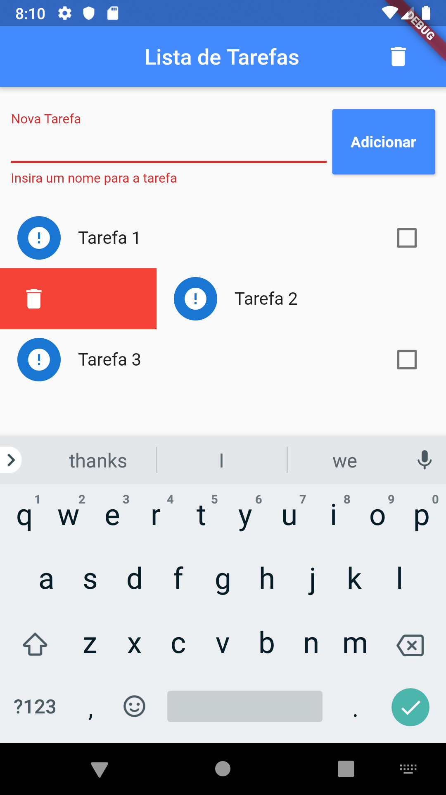

# Conversor Moeda

Conversor de moedas básico

Projeto 4 do curso [Criação de Apps Android e iOS com Flutter](https://www.udemy.com/curso-completo-flutter-app-android-ios/)

App básico de lista de tarefas.

# Adições originais

- Botão de limpar todas as tarefas
- Validação para não permitir tarefas com nome vazio

